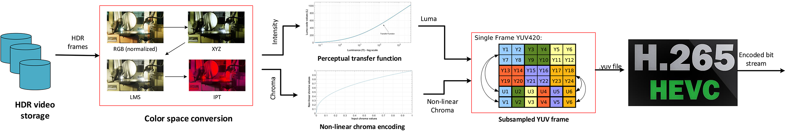
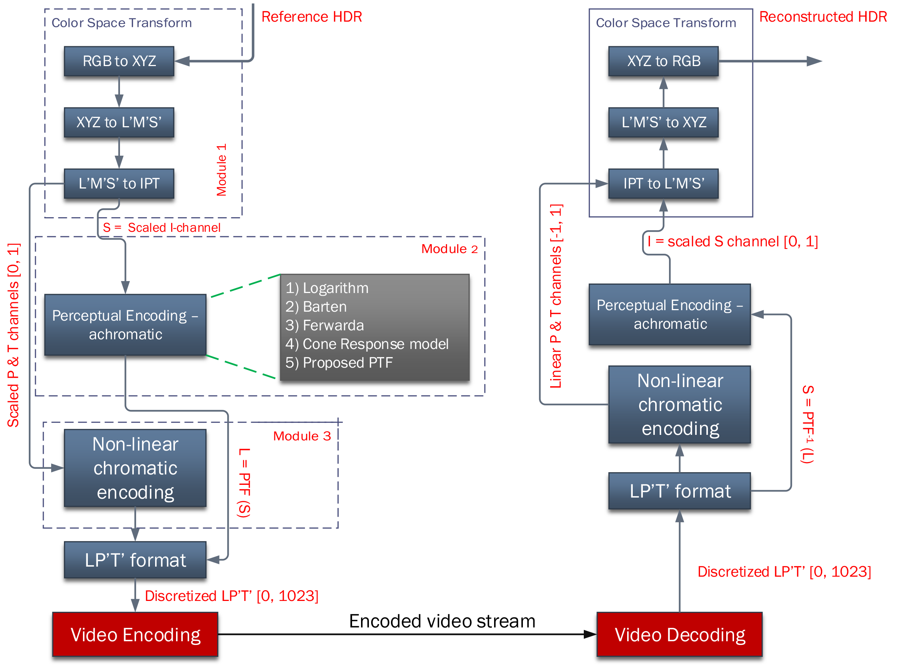
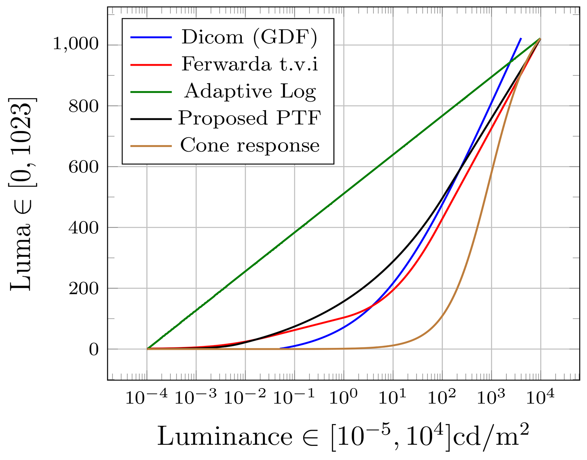
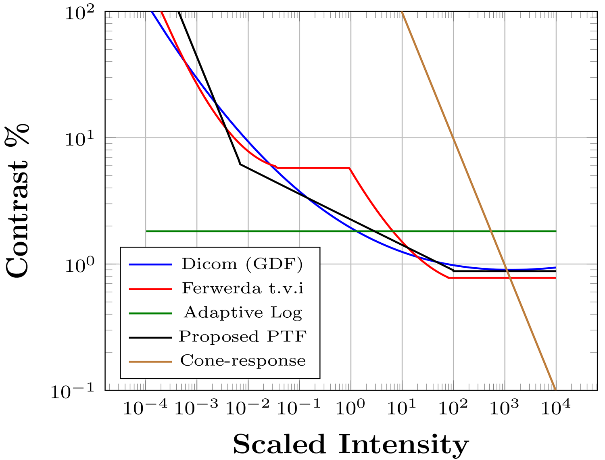

# Uniform Color Space based HDR Video Compression
This work proposes a novel HDR video compression algorithm which uses a perceptually uniform color opponent space, a novel perceptual transfer function to encode the dynamic range of the scene and a novel error minimization scheme for accurate chroma reproduction.

## Overall Pipeline:

*Figure 1: Overall HDR video compression pipeline of the proposed algorithm*

This HDR video compression algorithm follows the "non-backward compatible" scheme of HDR video compression algorithms where the algorithm converts input HDR video frames to a single "codec suitable" HDR video stream using higher bit-depth encoding (i.e. 10/12/14-bits/pixel/channel) using non-linear luminance and chroma preservation techniques as shown in Figure 1.

Input HDR video frames are first changed to the Intensity, Protan and Tritan (IPT) color opponent space described in [1]. The RGB to IPT color space conversion is shown in first block of Figure 1 and described as below: 

 	RGB --> XYZ --> LMS --> L'M'S' (Hunt-Pointer-Estevez fundamentals) --> IPT

The conversion to IPT uniform color opponent space facilitates a few desirable properties for compression:

###### a) the luminance and chroma information are now decorrelated such that individual channels can be manipulated for compression purposes

###### b) the perceptual uniformity provided by IPT are not prone to Hue compression artefacts seen in CIELAB/CIELUV (which were never really designed for HDR content manipulation).

Following the IPT conversion, the intensity and chroma channels are passed through two non-linear functions for luminance and chroma preservation and scaled to a desired bit-depth (10/12/14) depending upon the user input as described below. 
	
	input_depth = ipt * 2^bitdepth (where bitdepth = 10/12/14)
	
###### NOTE: We don't use 8-bits because that would be equivalent to Tone Mapping.

The output from this process is finally saved as a YUV file and pushed into the codec (x264/x265/AV1) anything which the user wishes to use.

## Framework

   

*Figure 2: Framework of the proposed HDR video compression algorithm*

Figure 2 shown above highlights the details of the proposed compression algorithm. Figure 2 shows that the algorithm has been designed in a plug-and-play format where the luminance and chroma preservation techniques can be swapped and changed to any existing preservation techniques (see Figure 2 luminance preservation)

The input RGB frames are first converted to IPT uniform color opponent space. Subsequently, the P and T channels are scaled such that I,P,T ∈ [0,1] and scaling values are stored as metadata.

### Perceptual transfer function to preserve Intensity information:
Since we are dealing with scene referred luminance values, the Intensity (I) channel is scaled such that I∈ [0.0001, 10000] cd/m2. This range is then converted to luma L such that L = f(I) where L ∈ [0, 1023] using a novel perceptual transfer function proposed in this work. 

  

*Figure 3: Threshold vs Intensity (TVI) plot (left) and Contrast vs. Intensity (CVI) plot (right)*

### Chroma preservation technique: 

## References
[1] F. Ebner and M. D. Fairchild, “Development and testing of a color space (ipt) with improved hue uniformity,” in Color and Imaging Conference, vol. 1998, pp. 8–13, Society for Imaging Science and Technology, 1998.
