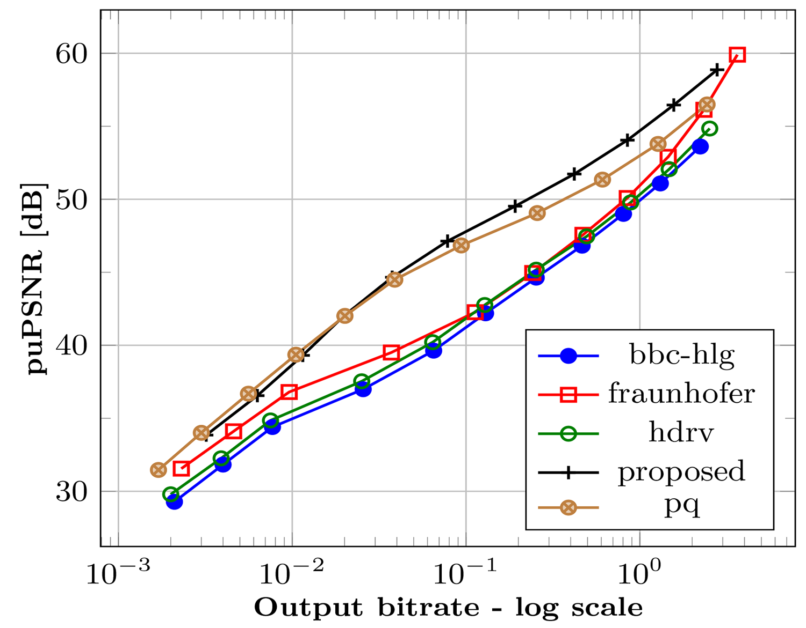
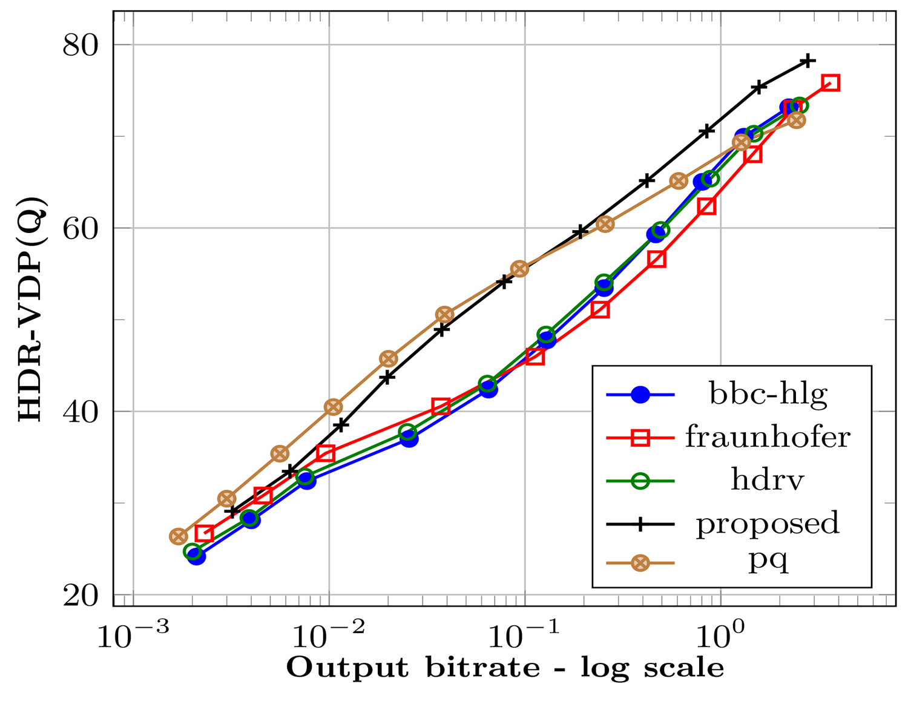

# Uniform Color Space based HDR Video Compression
This work proposes a novel HDR video compression algorithm which uses a perceptually uniform color opponent space, a novel perceptual transfer function to encode the dynamic range of the scene and a novel error minimization scheme for accurate chroma reproduction.

## Usage: 
The algorithm is divided into two main functions iCAM_Encode (the pre-processing part) which converts the HDR frames into 10-bit codec suitable YUV files and iCAM_Decode to convert decoded YUV files to output EXR frames. 

The iCAM_Encode usage is given as below:

	iCAM_Encode(frame_path, start_frame, frame_step, last_frame, write_path, bitdepth)
	
###### frame_path = "source/input EXR frame path"
###### start_frame = 0 (typically)
###### frame_step = 1 (typically but you can put 2/3/n depending upon the number of frames you want to skip)
###### last_frame = n-1 (if n is the number of frames you have in your folder)
###### write_path = "output YUV file path"
###### bitdepth = 10/12/14 (depending upon usage) - typically 10 as of now

Similarly, the iCAM_Decode is given as below: 

	iCAM_Decode(read_path, width, height, nFrames, dest_path, bitdepth)

###### read_path = "write path of the decoded YUV file" (typically same as the write path of the iCAM_Encode function)
###### width = resolution width of the HDR frame 
###### height = resolution height of the HDR frame
###### nFrames = number of the frames encoded (this is determined by the number of frames which has been encoded)
###### dest_path = "output directory where decompressed HDR frames will be dumped
###### bitdepth = 10/12/14 (depending upon usage) - typically 10 as of now

#### NOTE 1: As of now, the input frames are typically in the format 00000.exr, 00001.exr......00300.exr (i.e. %05d.exr) and the output frames are in the format frame_00000.exr, frame_00001.exr......frame_00300.exr (i.e. frame_%05d.exr).

#### NOTE 2: All frames are typically absolute value calibrated. Please refer to [8] for details about absolute calibration. 

## Encoding and decoding scripts (for x264 and x265):
Static binaries for both x264 and x265 can be used to encode 10-bit YUV files. Please ensure that the binary file downloaded supports 10-bit encoding.

### x264 usage:
	
	./x264 --profile high444 --preset veryslow --bframes 3 --b-adapt 2 --tune psnr --qp <quantization parameter (0 to 51)> --frames <number_of_frames> --fps <fps> --input-depth <input_depth (typically 10)>  --input-csp i444 --input-res <width> x <height> --output-csp <typically i420/i422/i444> -o </path/filename.264>  <input_file.yuv>
	
### x265 usage:
Unfortunately, unlike libx264, libx265 does not perform any subsampling. Therefore, if you need to subsample the YUV files to 420 or 422, you will need to use ffmpeg for subsampling. The input-csp in libx265 must match with output-csp. 

	./x265 --profile main444-10 --preset veryslow --bframes 3 --b-adapt 2 --tune psnr --qp <quantization parameter (0 to 51)> --frames <number_of_frames> --fps <fps> --input-depth <input_depth (typically 10)> --input-res <width> x <height> --input <input_file.yuv> --output-depth <output_depth (typically 10)> -o </path/filename.265>

## Overall Pipeline:

*Figure 1: Overall HDR video compression pipeline of the proposed algorithm*

This HDR video compression algorithm follows the "non-backward compatible" scheme of HDR video compression algorithms where the algorithm converts input HDR video frames to a single "codec suitable" HDR video stream using higher bit-depth encoding (i.e. 10/12/14-bits/pixel/channel) using non-linear luminance and chroma preservation techniques as shown in Figure 1.

Input HDR video frames are first changed to the Intensity, Protan and Tritan (IPT) color opponent space described in [1]. The RGB to IPT color space conversion is shown in first block of Figure 1 and described as below: 

 	RGB --> XYZ --> LMS --> L'M'S' (Hunt-Pointer-Estevez fundamentals) --> IPT

The conversion to IPT uniform color opponent space facilitates a few desirable properties for compression:

###### a) the luminance and chroma information are now decorrelated such that individual channels can be manipulated for compression purposes

###### b) the perceptual uniformity provided by IPT are not prone to Hue compression artefacts seen in CIELAB/CIELUV (which were never really designed for HDR content manipulation).

Following the IPT conversion, the intensity and chroma channels are passed through two non-linear functions for luminance and chroma preservation and scaled to a desired bit-depth (10/12/14) depending upon the user input as described below. 
	
	input_depth = ipt * 2^bitdepth (where bitdepth = 10/12/14)
	
###### NOTE: We don't use 8-bits because that would be equivalent to Tone Mapping.

The output from this process is finally saved as a YUV file and pushed into the codec (x264/x265/AV1) anything which the user wishes to use.

## Framework

   

*Figure 2: Framework of the proposed HDR video compression algorithm*

Figure 2 shown above highlights the details of the proposed compression algorithm. Figure 2 shows that the algorithm has been designed in a plug-and-play format where the luminance and chroma preservation techniques can be swapped and changed to any existing preservation techniques (see Figure 2 luminance preservation)

The input RGB frames are first converted to IPT uniform color opponent space. Subsequently, the P and T channels are scaled such that I,P,T ∈ [0,1] and scaling values are stored as metadata.

### Perceptual transfer function to preserve Intensity information:
Since we are dealing with scene referred luminance values, the Intensity (I) channel is scaled such that I∈ [0.0001, 10000] cd/m2. This range is then converted to luma L such that L = f(I) where L ∈ [0, 1023] using a novel perceptual transfer function proposed in this work. 

  

*Figure 3: Threshold vs Intensity (TVI) plot [9] (left) and Contrast vs. Intensity (CVI) plot [10] (right)*

The TVI plot in the left shows the plots for luminance to luma conversion using several existing as well a novel transfer function proposed as a part of this work. As seen in the TVI plot (left), the proposed transfer function facilitates a good balance between bit allocation towards lower luminance as well as higher luminance values. 

However, a TVI plot is not the only criteria to evaluate the effectiveness of luminance to luma conversion. Therefore, the CVI plot (right) shows demonstrates that the contrast preservation characteristics of the proposed function as compared to existing transfer functions. 

#### NOTE: For full details please refer to the explanation in the paper.

### Chroma preservation technique: 
This work also proposes a novel chroma preservation technique where a non-linear factor is used to determine the non-linearity required to transform the P & T channels such that the difference between the scaled (10-bit) floating point values and its corresponding integer conversion is minimum.

#### NOTE: Due to constraints of the mathematical operation to be described, the user is requested to refer to the paper for a detailed description which describes the derivation of the non-linear transform factor.

## Evaluation Results and Discussion
  

*Figure 4: Evaluation of the proposed algorithm against existing state-of-the-art*

The proposed algorithm along with the novel luminance and chroma preservation function was evaluated alongside four existing state-of-the-art HDR compression algorithms i.e. hdrv [2], BBC-HLG [3], Dolby-PQ [4] and Fraunhofer (temporally coherent adaptive LogLUV [5]) using multiple established HDR-specifc objective metrics, some of which  [6], [7] are shown in Figure 4. The robust and detailed methodology followed for this evaluation has been previously established in [8]. 

As can be seen the proposed algorithm performs better than existing state-of-the-art at bitrates >= 0.4 bpp. However, some of the algorithms such as PQ [4] outperforms the proposed algorithm at bitrates < 0.4 bpp. 

#### NOTE: For full evaluation results, please refer to the main manuscript as well as the supplementary materials provided along with this repository.

## References
[1] F. Ebner and M. D. Fairchild, “Development and testing of a color space (ipt) with improved hue uniformity,” in Color and Imaging Conference, vol. 1998, pp. 8–13, Society for Imaging Science and Technology, 1998.

[2] R. Mantiuk, G. Krawczyk, K. Myszkowski, and H.-P. Seidel, “Perception-motivated high dynamic range video encoding,” in ACM
SIGGRAPH 2004 Papers, SIGGRAPH ’04, (New York, NY, USA), pp. 733–741, ACM, 2004.

[3] T. Borer and A. Cotton, “A “display independent” high dynamic range television system,” September 2015.

[4] S. Miller, M. Nezamabadi, and S. Daly, “Perceptual signal coding for more efficient usage of bit codes,” SMPTE Motion Imaging Journal, vol. 122, pp. 52–59, May 2013.

[5] J.-U. Garbas and H. Thoma, “Temporally coherent luminance-to-luma mapping for high dynamic range video coding with H.264/AVC,” in Acoustics, Speech and Signal Processing (ICASSP), 2011 IEEE International Conference on, pp. 829–832, May 2011.

[6] T. O. Aydın, R. Mantiuk, and H.-P. Seidel, “Extending quality metrics to full dynamic range images,” in Human Vision and Electronic Imaging XIII, Proceedings of SPIE, (San Jose, USA), pp. 6806–10, January 2008.

[7] M. Narwaria, R. K. Mantiuk, M. P. Da Silva, and P. Le Callet, “HDRVDP-2.2: a calibrated method for objective quality prediction of high dynamic range and standard images,” Journal of Electronic Imaging, vol. 24, no. 1, p. 010501, 2015.

[8] R. Mukherjee, K. Debattista, T. Bashford-Rogers, P. Vangorp, R. Mantiuk, M. Bessa, B. Waterfield, and A. Chalmers, “Objective and subjective evaluation of high dynamic range video compression,” Signal Processing: Image Communication, vol. 47, pp. 426–437, 2016.

[9] J. A. Ferwerda, S. N. Pattanaik, P. Shirley, and D. P. Greenberg, “A model of visual adaptation for realistic image synthesis,” in Proceedings of the 23rd annual conference on Computer graphics and interactive techniques, pp. 249–258, ACM, 1996.

[10] G. Ward, “Defining dynamic range,” in ACM SIGGRAPH 2008 Classes, SIGGRAPH ’08, (New York, NY, USA), pp. 30:1–30:3, ACM, 2008
